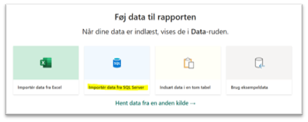
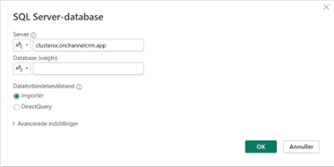
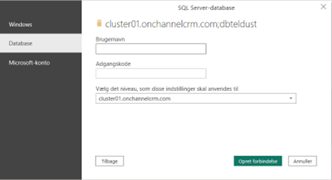

**Sådan forbinder du ChannelCRM til PowerBi**

26-03-2025

Hermed en vejledning til hvorledes man kan hente data fra ChannelCRM ud via PowerBi.

ChannelCRM arbejder med et højt sikkerhedsniveau, så vi tillader kun forbindelse fra IP-adresser som vi har godkendt på forhånd, så inden du skriver skal du finde den IP adresse som du arbejder ud fra. Dette gør du ved at trykke på dette link. <https://myip.dk>

Når du har noteret din IP adresse, så sender du en mail til [support@channelcrm.dk](mailto:support@channelcrm.dk) for at få bruger og loginoplysninger som du skal bruge i den videre proces herunder.

Hent Power BI desktop appen fra Microsoft, og åben den.

Tryk herefter på ’Importér data fra SQL Server’. Herefter skal du skrive

Server = Navnet på det ’cluster’ hvor din løsning ligger. Denne info får du fra ChannelCRM Supporten

Database = her skal du ikke skrive noget

Nu skal du indtaste det brugernavn og password som du også har modtaget fra ChannelCRM supporten. Det er vigtigt at du har valg Database menupunktet til venstre

Herefter trykker du på ’opret forbindelse’ og så er PowerBi koblet til din database hos ChannelCRM og du kan nu starte arbejdet med rapporter.

